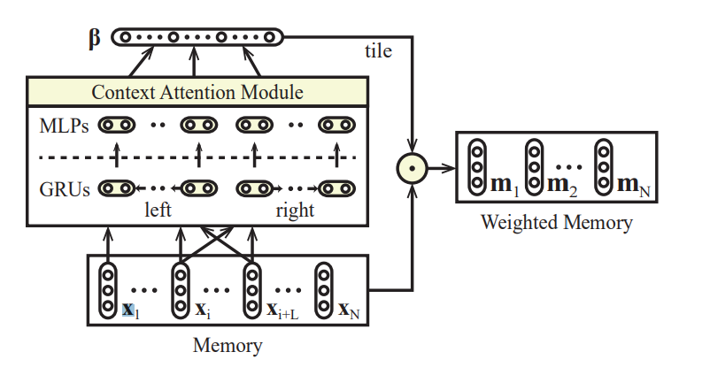
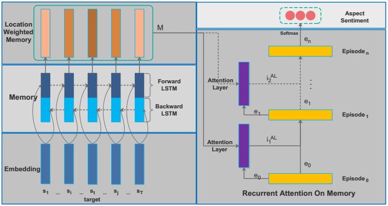
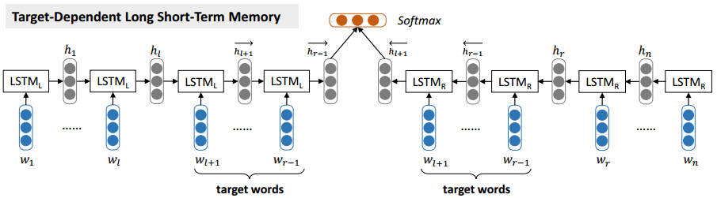
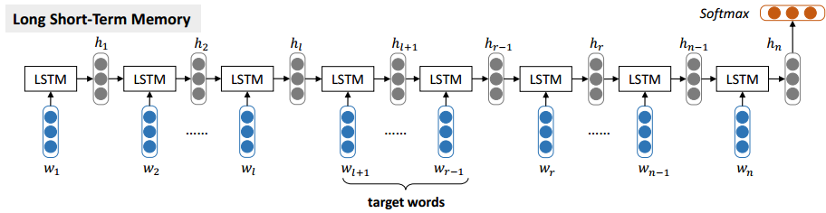

# ABSA-PyTorch

> Aspect Based Sentiment Analysis, PyTorch Implementations.
>
> 基于方面的情感分析，使用PyTorch实现。

  

## Requirement

* PyTorch 0.4.0
* NumPy 1.13.3
* tensorboardX 1.2
* Python 3.6
* GloVe pre-trained word vectors (See `data_utils.py` for more detail)
  * Download pre-trained word vectors [here](https://github.com/stanfordnlp/GloVe#download-pre-trained-word-vectors),
  * extract the [glove.twitter.27B.zip](http://nlp.stanford.edu/data/wordvecs/glove.twitter.27B.zip) and [glove.42B.300d.zip](http://nlp.stanford.edu/data/wordvecs/glove.42B.300d.zip) to the root directory

## Usage

### Training

```sh
python train.py --model_name ian --dataset twitter --logdir ian_logs
```

### See the training process (needs to install TensorFlow)

```sh
tensorboard --logdir=./ian_logs
```

## Implemented models

### Cabasc ([cabasc.py](./models/cabasc.py)))
Qiao Liu, Haibin Zhang, Yifu Zeng, Ziqi Huang, and Zufeng Wu. 2018. Content Attention Model for Aspect Based Sentiment Analysis. In Proceedings of the 2018 World Wide Web Conference (WWW '18). International World Wide Web Conferences Steering Committee, Republic and Canton of Geneva, Switzerland, 1023-1032.[[pdf]](http://delivery.acm.org/10.1145/3190000/3186001/p1023-liu.pdf?ip=156.83.3.2&id=3186001&acc=OPEN&key=4D4702B0C3E38B35%2E4D4702B0C3E38B35%2E4D4702B0C3E38B35%2E6D218144511F3437&__acm__=1527502562_2168470ffdb1b6b512d35dcba3ebf660)



### RAM ([ram.py](./models/ram.py))
Chen, Peng, et al. "Recurrent Attention Network on Memory for Aspect Sentiment Analysis." Proceedings of the 2017 Conference on Empirical Methods in Natural Language Processing. 2017. [[pdf]](http://www.aclweb.org/anthology/D17-1047)




### MemNet ([memnet.py](./models/memnet.py))
Tang, Duyu, B. Qin, and T. Liu. "Aspect Level Sentiment Classification with Deep Memory Network." Conference on Empirical Methods in Natural Language Processing 2016:214-224. [[pdf]](https://arxiv.org/pdf/1605.08900)


### IAN ([ian.py](./models/ian.py))
Ma, Dehong, et al. "Interactive Attention Networks for Aspect-Level Sentiment Classification." arXiv preprint arXiv:1709.00893 (2017). [[pdf]](https://arxiv.org/pdf/1709.00893)


### TD-LSTM ([td_lstm.py](./models/td_lstm.py))

Tang, Duyu, et al. "Effective LSTMs for Target-Dependent Sentiment Classification." Proceedings of COLING 2016, the 26th International Conference on Computational Linguistics: Technical Papers. 2016. [[pdf]](https://arxiv.org/pdf/1512.01100)




### LSTM ([lstm.py](./models/lstm.py))




## Reviews / Surveys

Zhang, Lei, Shuai Wang, and Bing Liu. "Deep Learning for Sentiment Analysis: A Survey." arXiv preprint arXiv:1801.07883 (2018). [[pdf]](https://arxiv.org/pdf/1801.07883)

Young, Tom, et al. "Recent trends in deep learning based natural language processing." arXiv preprint arXiv:1708.02709 (2017). [[pdf]](https://arxiv.org/pdf/1708.02709)

## Contributions

Feel free to contribute!

You can raise an issue or submit a pull request, whichever is more convenient for you.

## Licence

MIT License
