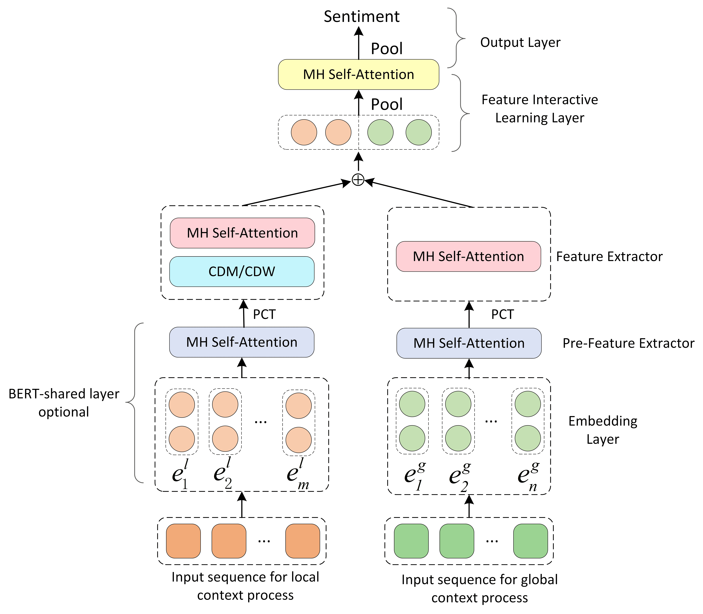

# ABSA-PyTorch
<!-- ALL-CONTRIBUTORS-BADGE:START - Do not remove or modify this section -->
[](#contributors-)
<!-- ALL-CONTRIBUTORS-BADGE:END -->

> Aspect Based Sentiment Analysis, PyTorch Implementations.
>
> 基于方面的情感分析，使用PyTorch实现。


[](https://gitter.im/ABSA-PyTorch/community?utm_source=badge&utm_medium=badge&utm_campaign=pr-badge)

## Requirement

* pytorch >= 0.4.0
* numpy >= 1.13.3
* sklearn
* python 3.6 / 3.7
* pytorch-transformers == 1.2.0
  * See [pytorch-transformers](https://github.com/huggingface/pytorch-transformers) for more detail.

To install requirements, run `pip install -r requirements.txt`.


For non-BERT-based models,
GloVe pre-trained word vectors are required (See [data_utils.py](./data_utils.py) for more detail)
  * Download pre-trained word vectors [here](https://github.com/stanfordnlp/GloVe#download-pre-trained-word-vectors),
  * extract the [glove.twitter.27B.zip](http://nlp.stanford.edu/data/wordvecs/glove.twitter.27B.zip) and [glove.42B.300d.zip](http://nlp.stanford.edu/data/wordvecs/glove.42B.300d.zip) to the root directory

## Usage

### Training

```sh
python train.py --model_name bert_spc --dataset restaurant
```

See [train.py](./train.py) for more training arguments.

Refer to [train_k_fold_cross_val.py](./train_k_fold_cross_val.py) for k-fold cross validation support.

### Inference

Please refer to [infer_example.py](./infer_example.py) for non-BERT models.
Please refer to [infer_example_bert_models.py](./infer_example_bert_models.py) for BERT models.

### Tips

* For non-BERT-based models, training procedure is not very stable.
* BERT-based models are more sensitive to hyperparameters (especially learning rate) on small data sets, see [this issue](https://github.com/songyouwei/ABSA-PyTorch/issues/27).
* Fine-tuning on the specific task is necessary for releasing the true power of BERT.

## BERT-based models

### LCF-BERT ([lcf_bert.py](./models/lcf_bert.py))
Zeng Biqing, Yang Heng, et al. "LCF: A Local Context Focus Mechanism for Aspect-Based Sentiment Classification." Applied Sciences. 2019, 9, 3389. [[pdf]](https://www.mdpi.com/2076-3417/9/16/3389/pdf)



### AEN-BERT ([aen.py](./models/aen.py))
Song, Youwei, et al. "Attentional Encoder Network for Targeted Sentiment Classification." arXiv preprint arXiv:1902.09314 (2019). [[pdf]](https://arxiv.org/pdf/1902.09314.pdf)


### BERT for Sentence Pair Classification ([bert_spc.py](./models/bert_spc.py))
Devlin, Jacob, et al. "Bert: Pre-training of deep bidirectional transformers for language understanding." arXiv preprint arXiv:1810.04805 (2018). [[pdf]](https://arxiv.org/pdf/1810.04805.pdf)


## Non-BERT-based models

### MGAN ([mgan.py](./models/mgan.py))
Fan, Feifan, et al. "Multi-grained Attention Network for Aspect-Level Sentiment Classification." Proceedings of the 2018 Conference on Empirical Methods in Natural Language Processing. 2018. [[pdf]](http://aclweb.org/anthology/D18-1380)


### AOA ([aoa.py](./models/aoa.py))
Huang, Binxuan, et al. "Aspect Level Sentiment Classification with Attention-over-Attention Neural Networks." arXiv preprint arXiv:1804.06536 (2018). [[pdf]](https://arxiv.org/pdf/1804.06536.pdf)


### TNet ([tnet_lf.py](./models/tnet_lf.py))
Li, Xin, et al. "Transformation Networks for Target-Oriented Sentiment Classification." arXiv preprint arXiv:1805.01086 (2018). [[pdf]](https://arxiv.org/pdf/1805.01086)


### Cabasc ([cabasc.py](./models/cabasc.py))
Liu, Qiao, et al. "Content Attention Model for Aspect Based Sentiment Analysis." Proceedings of the 2018 World Wide Web Conference on World Wide Web. International World Wide Web Conferences Steering Committee, 2018.


### RAM ([ram.py](./models/ram.py))
Chen, Peng, et al. "Recurrent Attention Network on Memory for Aspect Sentiment Analysis." Proceedings of the 2017 Conference on Empirical Methods in Natural Language Processing. 2017. [[pdf]](http://www.aclweb.org/anthology/D17-1047)


### MemNet ([memnet.py](./models/memnet.py))
Tang, Duyu, B. Qin, and T. Liu. "Aspect Level Sentiment Classification with Deep Memory Network." Conference on Empirical Methods in Natural Language Processing 2016:214-224. [[pdf]](https://arxiv.org/pdf/1605.08900)


### IAN ([ian.py](./models/ian.py))
Ma, Dehong, et al. "Interactive Attention Networks for Aspect-Level Sentiment Classification." arXiv preprint arXiv:1709.00893 (2017). [[pdf]](https://arxiv.org/pdf/1709.00893)


### ATAE-LSTM ([atae_lstm.py](./models/atae_lstm.py))
Wang, Yequan, Minlie Huang, and Li Zhao. "Attention-based lstm for aspect-level sentiment classification." Proceedings of the 2016 conference on empirical methods in natural language processing. 2016.


### TD-LSTM ([td_lstm.py](./models/td_lstm.py))

Tang, Duyu, et al. "Effective LSTMs for Target-Dependent Sentiment Classification." Proceedings of COLING 2016, the 26th International Conference on Computational Linguistics: Technical Papers. 2016. [[pdf]](https://arxiv.org/pdf/1512.01100)


### LSTM ([lstm.py](./models/lstm.py))


## Reviews / Surveys

Zhang, Lei, Shuai Wang, and Bing Liu. "Deep Learning for Sentiment Analysis: A Survey." arXiv preprint arXiv:1801.07883 (2018). [[pdf]](https://arxiv.org/pdf/1801.07883)

Young, Tom, et al. "Recent trends in deep learning based natural language processing." arXiv preprint arXiv:1708.02709 (2017). [[pdf]](https://arxiv.org/pdf/1708.02709)

## Contributions

Feel free to contribute!

You can raise an issue or submit a pull request, whichever is more convenient for you.

## Licence

MIT License

## Contributors ✨

Thanks goes to these wonderful people ([emoji key](https://allcontributors.org/docs/en/emoji-key)):

<!-- ALL-CONTRIBUTORS-LIST:START - Do not remove or modify this section -->
<!-- prettier-ignore-start -->
<!-- markdownlint-disable -->
<table>
  <tr>
    <td align="center"><a href="https://github.com/AlbertoPaz"><br /><sub><b>Alberto Paz</b></sub></a><br /><a href="https://github.com/songyouwei/ABSA-PyTorch/commits?author=AlbertoPaz" title="Code">💻</a></td>
    <td align="center"><a href="http://taojiang0923@gmail.com"><br /><sub><b>jiangtao </b></sub></a><br /><a href="https://github.com/songyouwei/ABSA-PyTorch/commits?author=jiangtaojy" title="Code">💻</a></td>
    <td align="center"><a href="https://genezc.github.io"><br /><sub><b>WhereIsMyHead</b></sub></a><br /><a href="https://github.com/songyouwei/ABSA-PyTorch/commits?author=GeneZC" title="Code">💻</a></td>
    <td align="center"><a href="https://github.com/songyouwei"><br /><sub><b>songyouwei</b></sub></a><br /><a href="https://github.com/songyouwei/ABSA-PyTorch/commits?author=songyouwei" title="Code">💻</a></td>
    <td align="center"><a href="https://github.com/yangheng95"><br /><sub><b>YangHeng</b></sub></a><br /><a href="https://github.com/songyouwei/ABSA-PyTorch/commits?author=yangheng95" title="Code">💻</a></td>
    <td align="center"><a href="https://github.com/rmarcacini"><br /><sub><b>rmarcacini</b></sub></a><br /><a href="https://github.com/songyouwei/ABSA-PyTorch/commits?author=rmarcacini" title="Code">💻</a></td>
  </tr>
</table>

<!-- markdownlint-enable -->
<!-- prettier-ignore-end -->
<!-- ALL-CONTRIBUTORS-LIST:END -->

This project follows the [all-contributors](https://github.com/all-contributors/all-contributors) specification. Contributions of any kind welcome!